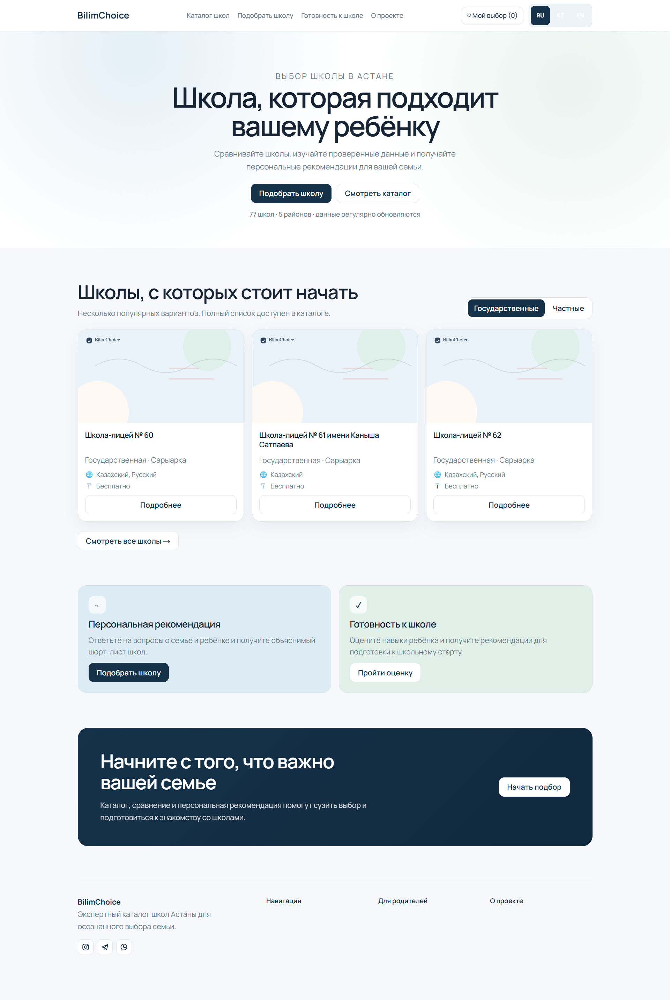
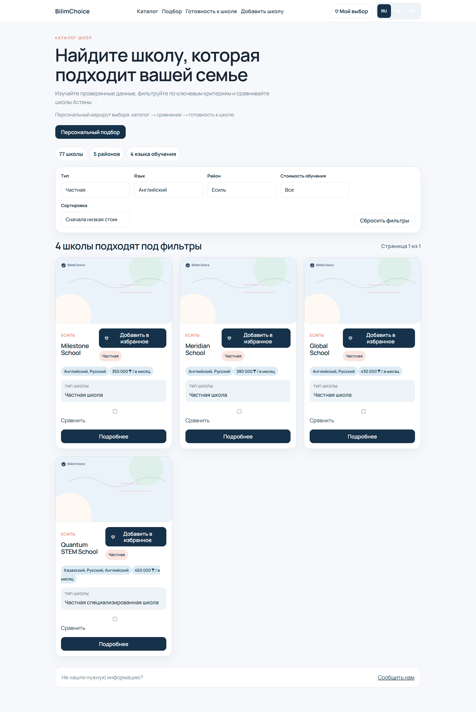
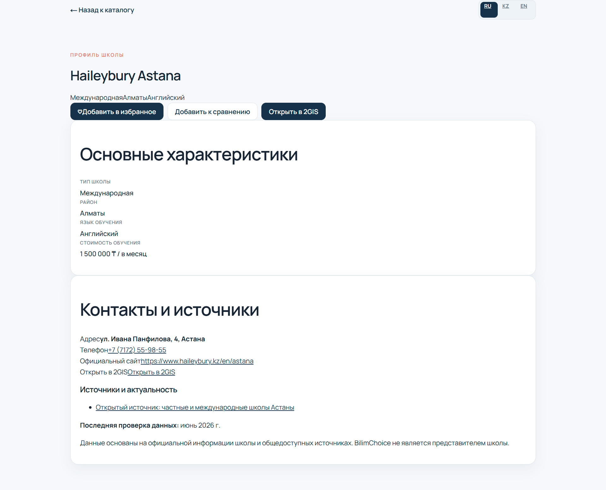
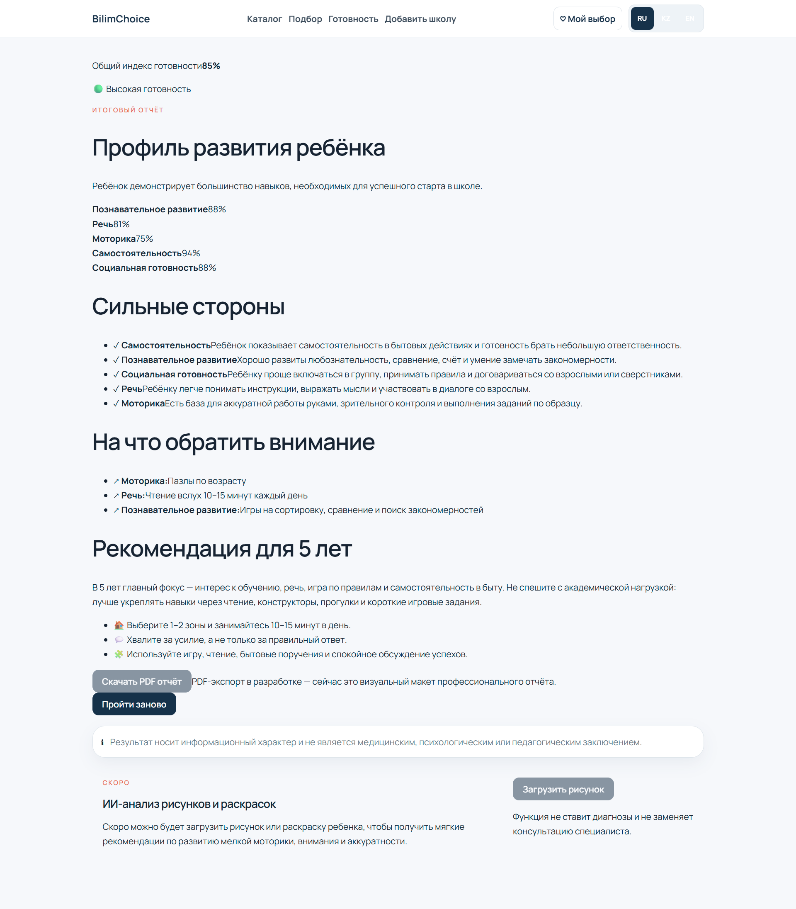

# BilimChoice

Цифровая платформа выбора и сравнения школ Казахстана.

## О проекте

BilimChoice помогает родителям подобрать школу по району, языку обучения,
стоимости, рейтингу, программам и другим параметрам.

## Скриншоты

### Главная страница



### Каталог школ



### Карточка школы



### Оценка готовности к школе



## Scripts

```bash
npm run dev
npm run build
npm test
```

The school data lives in `src/data/schools.js` and is validated by `scripts/validate-schools.mjs`.

## School Readiness Assessment scoring

The `/school-readiness` page contains a 10-question MVP assessment for parents. Each question has three answers:

- `Да / Yes` = 10 points
- `Частично / Partially` = 5 points
- `Нет / No` = 0 points

The maximum score is 100 points. Results are grouped as follows:

- 90–100: high readiness for school
- 70–89: good readiness for school
- 50–69: there are areas to develop
- 0–49: additional preparation is recommended

The page derives strengths from questions answered `Да / Yes` and improvement areas from questions answered `Частично / Partially` or `Нет / No`. School recommendations use the existing `src/data/schools.js` dataset: higher readiness prioritizes gymnasiums, lyceums, specialized, and advanced-learning schools; medium readiness prioritizes public and adaptive options; lower readiness prioritizes schools and programs with softer adaptation signals such as after-school support, school bus availability, or no required admission test.
